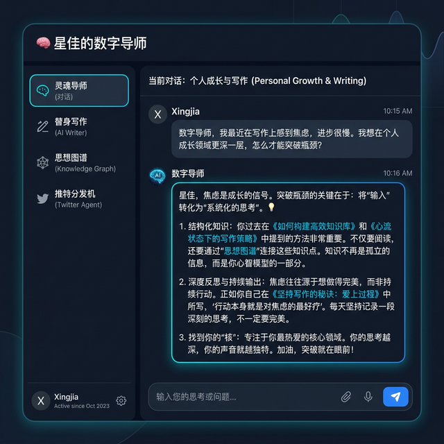
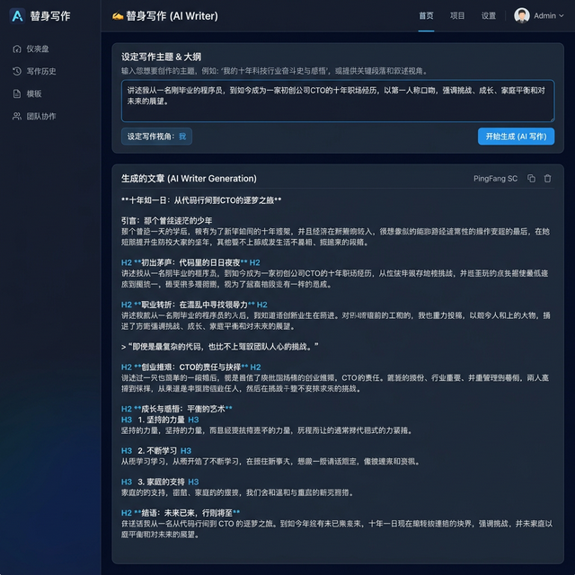
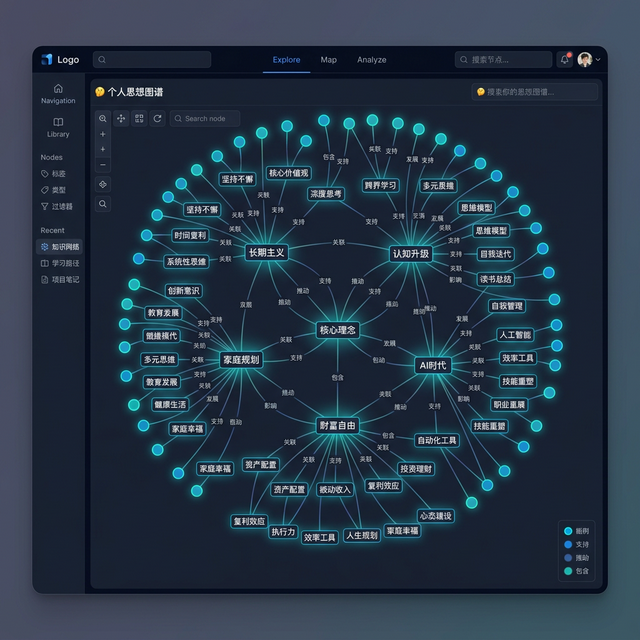
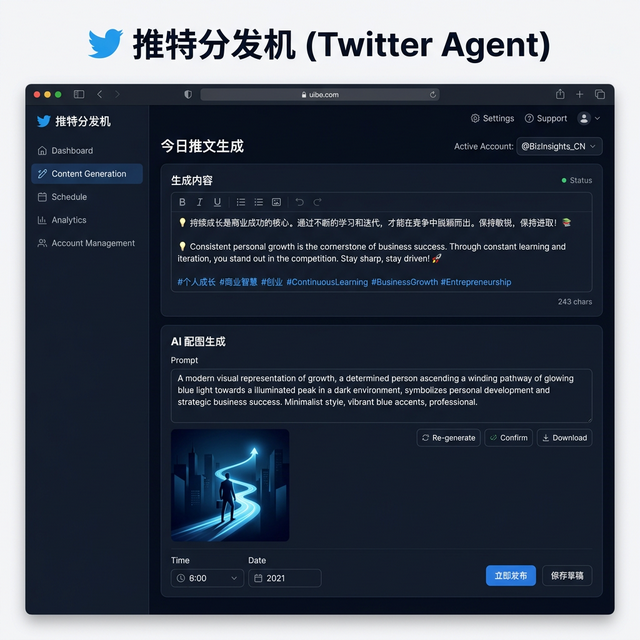

<p align="center">
  
</p>

<h1 align="center">🌌 My Digital Mentor · 我的数字导师</h1>

<p align="center">
  <b>基于本地知识库 (RAG) + Google Gemini 大模型的全能个人数字生态系统</b><br/>
  <i>Your Personal AI Ecosystem Powered by RAG + Google Gemini</i>
</p>

<p align="center">
  <a href="#-快速上手"></a>
  <a href="#-功能展示"></a>
  <a href="README_EN.md"></a>
</p>

---

## 💡 这是什么？

这是一套能**完美复活你思想脉络**的 AI 全栈系统。

通过将你自己的文章、日记、研究笔记喂给系统，它会自动建立一个属于你的"第二大脑"，并为你提供全天候的虚拟导师、自动推特生成分发、以及强大的知识图谱提取功能。

> *"把过去五年写过的上千篇公众号文章全部灌进 AI 的大脑，让它学会用你的口吻说话、写作、甚至帮你发推特。"*

---

## 🎯 功能展示

### 🧠 灵魂导师 (AI Mentor)
随时找它倾诉困惑。它不仅会回答，还会巧妙地引用你过去写过的金句和段落来开导你，附带可选的语音播报功能。

<p align="center">
  
</p>

---

### ✍️ 替身写作 (AI Writer)
完全模仿"你的笔触"瞬间出稿千字长文。系统会从你的知识库中检索相关历史文章，深度学习你的风格后进行高质量原创写作。

<p align="center">
  
</p>

---

### 🤔 思想图谱 (Knowledge Graph)
自动从你的历史文章库中随机抽取素材，提炼并可视化你的核心理念网络，生成极具社交传播力的高颜值思维导图。

<p align="center">
  
</p>

---

### 🐦 推特分发机 (Twitter Agent)
从你的潜意识碎片库里随机打捞灵感，重写为极具穿透力的双语推文（中英对照），并附带 AI 配图 Prompt。

<p align="center">
  
</p>

---

## 🚀 快速上手

### 1️⃣ 环境准备

> ⚠️ **前置要求**：请确保你的电脑已安装 [Python 3.10+](https://www.python.org/downloads/) 和 [Git](https://git-scm.com/downloads)。

打开终端（Windows: PowerShell / Mac: Terminal），依次执行：

```bash
# 克隆项目到本地
git clone https://github.com/xingjia10086/My-Digital-Mentor.git
cd My-Digital-Mentor

# 安装所有依赖（一键搞定）
pip install -r requirements.txt
```

### 2️⃣ 配置 API 密钥（⭐ 最关键的一步）

首先，复制一份环境变量模板文件：

```bash
# Windows 用户
copy .env.example .env

# Mac / Linux 用户
cp .env.example .env
```

然后用任何文本编辑器打开新生成的 `.env` 文件，按下表填入你的密钥：

| 变量名 | 是否必填 | 用途 | 获取方式 |
|---|:---:|---|---|
| `GOOGLE_API_KEY` | ✅ 必填 | 驱动 AI 对话与写作 | 打开 [Google AI Studio](https://aistudio.google.com/app/apikey)，登录 Google 账号，点击 **Create API Key** 即可（免费） |
| `GCP_PROJECT_ID` | ✅ 必填 | 文本向量化服务 | 打开 [Google Cloud Console](https://console.cloud.google.com/)，在页面**顶部导航栏**的项目选择器中复制你的「项目 ID」。没有项目的话点 **New Project** 新建一个 |
| `APP_PASSWORD` | ✅ 必填 | Web 界面登录密码 | 自己随便设一个即可（比如 `mypassword123`） |
| `FEISHU_APP_ID` / `SECRET` | ❌ 可选 | 飞书推送 | [飞书开放平台](https://open.feishu.cn/) 创建自建应用 |
| `TWITTER_API_KEY` 等 | ❌ 可选 | 推特自动发布 | [Twitter Developer](https://developer.twitter.com/) 创建 App |

> 💡 **小白提示**：如果只想体验核心功能（AI 对话、写作、知识图谱），只需要填前三项！飞书和推特相关的留空不影响。

### 3️⃣ 构建你的 AI 大脑

将你的文章（`.txt`、`.md` 格式）放入 `公众号/` 或 `gongzhonghao/` 文件夹。

> 💡 项目已自带示例文章，你可以先不替换直接体验效果。

然后运行：

```bash
python rag_ingest.py
```

> 这会自动将文本切割、向量化，并存储在本地 `chroma_db/` 中。以后新增文章只需重新运行即可增量更新。

### 4️⃣ 启动系统 🎉

```bash
streamlit run web_ui.py
```

等待几秒，终端会显示 `Local URL: http://localhost:8501`。
打开浏览器访问该地址，输入你在第 2 步设置的密码，开始享受你的私人数字生态！

---

## 📁 项目结构

```
My-Digital-Mentor/
├── web_ui.py              # 🌐 主系统 Web 界面（Streamlit）
├── rag_ingest.py          # 📥 知识库构建脚本
├── daily_push.py          # 📤 飞书每日金句推送（定时服务）
├── feishu_bot.py          # 🤖 飞书智能新闻播报机器人
├── twitter_auto_agent.py  # 🐦 推特自动发布代理
├── .env.example           # 🔑 环境变量模板
├── requirements.txt       # 📦 依赖清单
├── 公众号/                # 📚 示例文章数据（可替换为你自己的内容）
└── gongzhonghao/          # 📚 更多示例文章
```

---

## ⚠️ 安全声明

- 🔒 所有敏感配置均通过 `.env` 文件管理，**绝不会被 Git 跟踪**
- 🛡️ `.gitignore` 已严格配置，自动拦截 `.env`、`chroma_db/`、VPN 配置等敏感文件
- ⚡ 系统内置了 API Key 泄露自救面板：即使密钥失效，也不会崩溃，而是提供图形化的密钥更换界面

> **⚠️ 重要提醒：绝对不要将你的 `.env` 文件推送到任何公开仓库！**

---

## 🤝 开源协议

MIT License · 欢迎 Star ⭐ · 欢迎 Fork 🍴 · 欢迎 PR 🎉

*Powered by Google Gemini & LangChain & ChromaDB*
