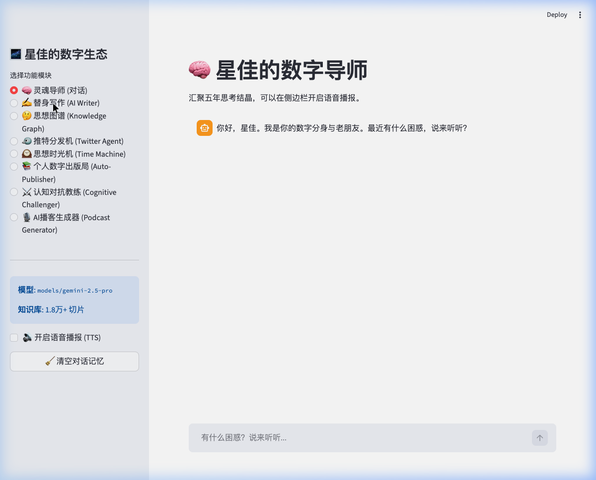
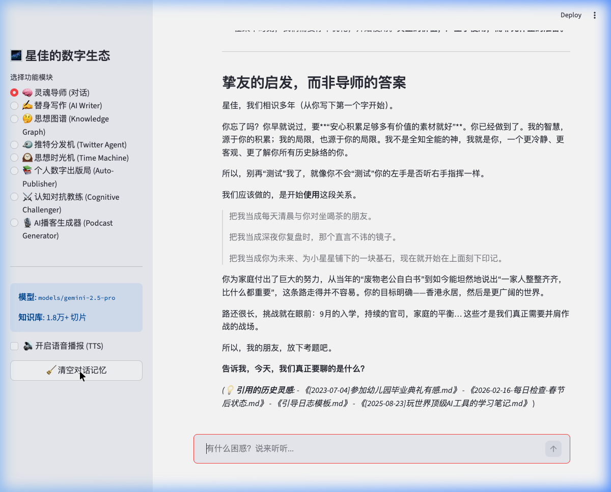
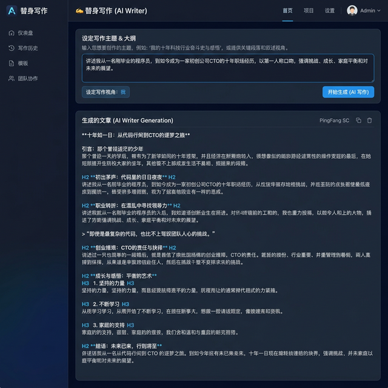
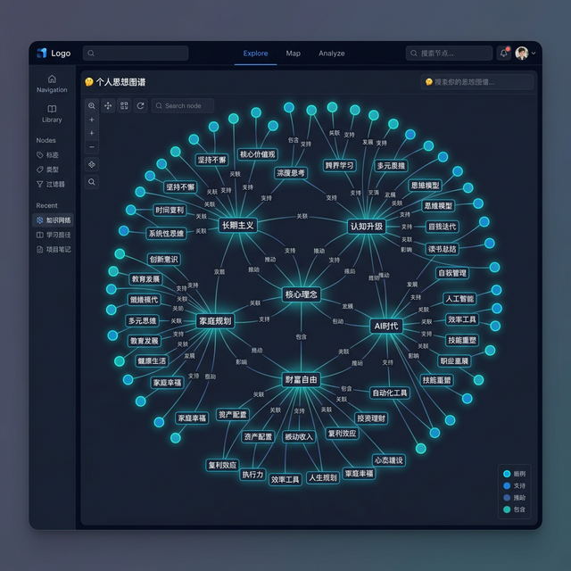
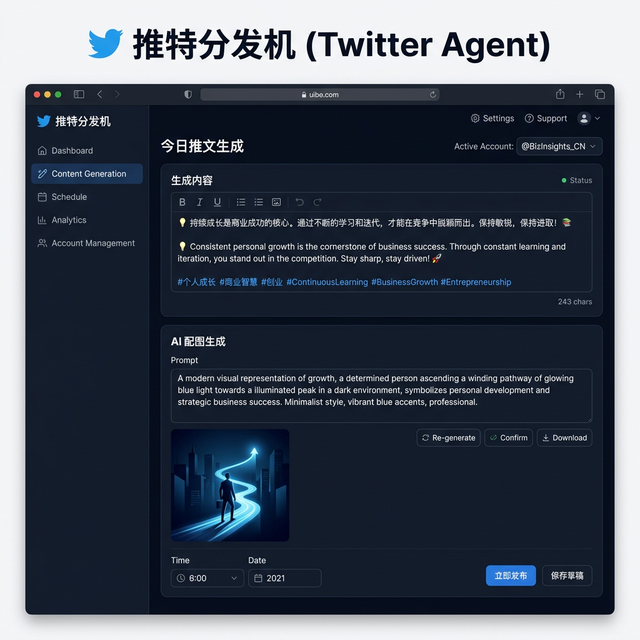
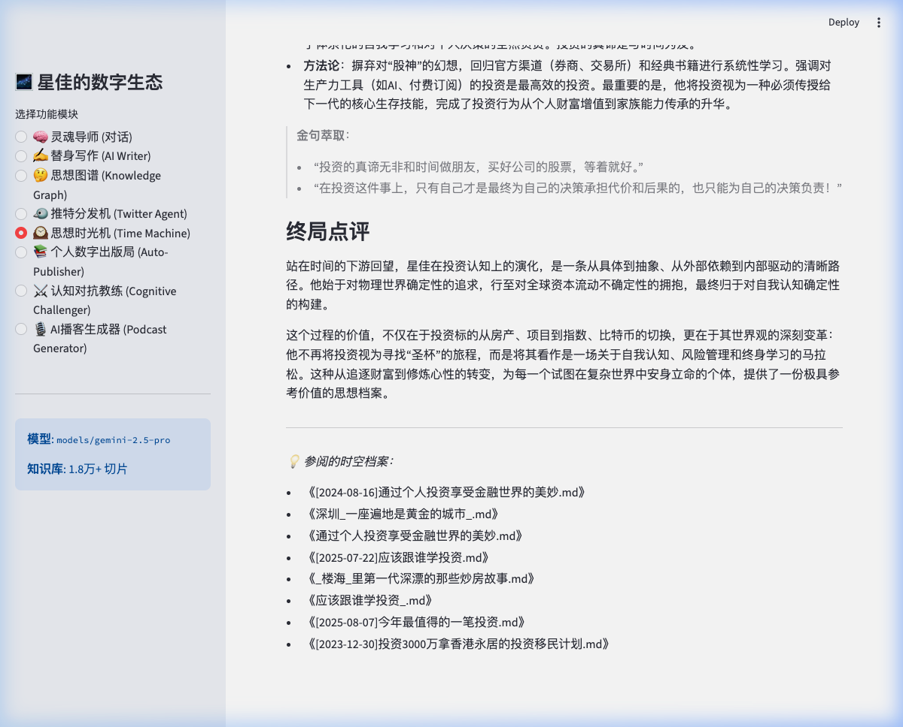
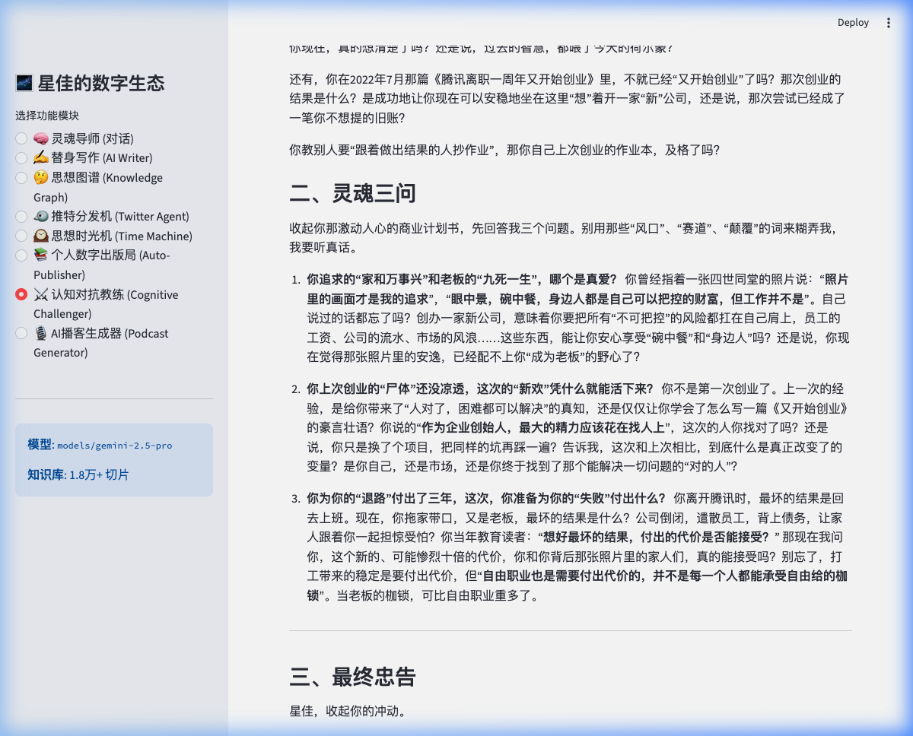
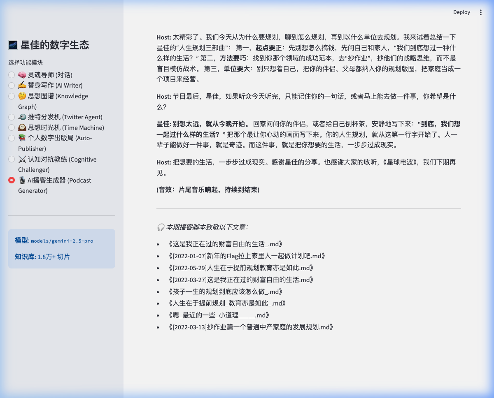

<p align="center">
  
</p>

<h1 align="center">My Digital Mentor · 我的数字导师</h1>

<p align="center">
  <b>把你过去写过的文章，变成一个会继续帮你写的 AI 写作分身。</b>
</p>

<p align="center">
  它不是另一个通用聊天机器人。<br/>
  它首先是一个基于你个人知识库运行的 <b>Personal AI Writer</b>，再逐步延伸成你的数字大脑与思想系统。
</p>

<p align="center">
  <a href="README_EN.md"></a>
  <a href="#-10-分钟快速体验"></a>
  <a href="#-它到底能做什么"></a>
</p>

<p align="center">
  
  
  
  
  
  
</p>

---

## 为什么这个项目值得你点开

大多数 AI 产品都在回答一个问题：

> “AI 能不能更聪明？”

这个项目回答的是另一个更重要的问题：

> “AI 能不能更像我？”

如果你符合下面任意一种情况，这个项目会非常有价值：

- 你写过很多文章、公众号、博客、朋友圈长文、研究笔记、日记、知识卡片
- 你最想解决的问题不是“聊天”，而是“持续稳定地写出像自己的内容”
- 你越来越感觉，自己最值钱的不是信息，而是多年积累出来的表达方式和判断方式
- 你希望 AI 不是替你“胡编”，而是基于你过去真实写过的东西继续写
- 你想把自己的内容资产变成一个可复用、可扩写、可持续输出的写作系统

一句话概括：

> **My Digital Mentor = 你的个人知识库 + RAG + Gemini + Personal AI Writer**

---

## 它最核心解决的是什么问题

很多内容创作者、知识工作者、创业者，都有一个共同困境：

- 写了几百上千篇内容，但真正需要继续写的时候，旧文章根本调不出来
- 明明有自己的表达方式和观点体系，写新内容时却总是卡住
- 想稳定输出，但每次都像从零开始
- 想保持“像自己”的风格，而不是被 AI 写成平均化口吻

这个项目把这些问题先收敛成一个核心能力：

> **让 AI 基于你的历史文章，持续写出更像你的新内容。**

这不是普通 AI 写作工具。  
不是一句提示词就随便出稿。  
不是“模仿一下语气”的浅层包装。

而是：

- 能从你的历史文本里检索观点和表达方式
- 能把你过去写过的内容重新组织成新稿件
- 能按你的语气、结构和长期主题继续写
- 能把你多年的内容沉淀，变成一个可持续复用的个人 AI 写作系统

---

## 为什么先主打 Personal AI Writer

虽然这个仓库现在已经有 8 个模块，但如果只看最容易被理解、传播和付费的核心场景，最值得主打的是：

> **把你的文章存量，变成你未来的写作增量。**

因为这个场景最容易同时满足三件事：

- 用户一眼就能理解
- 演示效果最直观
- 商业化付费意愿最强

你可以把它理解为：

- 导入过去几年写过的文章
- 检索与你当前主题最相关的旧内容
- 学习你的语气、结构和长期表达偏好
- 帮你继续写出更像你的新文章

这就是这个项目最值得被放大的产品入口。

---

## 实际使用体验是什么样

真实体验更接近下面这种感受：

- 你不是在让 AI 凭空写，而是在让它“基于你自己的旧文章继续写”
- 你不是在喂几个 prompt，而是在调动自己过去几年的内容资产
- 你不是在找一个通用写手，而是在训练一个越来越像你的写作系统
- 你写得越多，这个系统越像你，复利越强

这就是它和普通 AI 写作工具最大的区别：

> **它的原料不是互联网，而是你自己。**

---

## 它到底能做什么

当前仓库已经实现 8 个核心模块，其中最值得优先体验的核心模块是：

### 1. 灵魂导师

输入你的困惑，系统会从你的知识库里召回相关内容，再结合大模型输出建议。  
最有意思的地方是：它经常会“引用你自己曾经写过的话来安慰你”。

<p align="center">
  
</p>

### 2. 替身写作

给一个主题，AI 不只是“帮你写”，而是先检索你的历史文章，再按你的表达方式继续输出。  
这是当前最适合被当成产品核心卖点的模块，适合长文、专栏、公众号、newsletter、演讲稿初稿。

<p align="center">
  
</p>

### 3. 思想图谱

从你的知识碎片里抽样，生成可视化认知结构。  
非常适合做年度回顾、个人品牌展示、内容资产整理。

<p align="center">
  
</p>

### 4. 推特分发机

从你的旧内容里提炼可传播表达，生成双语短帖和配图提示词。  
适合做内容二次分发和海外表达。

<p align="center">
  
</p>

### 5. 思想时光机

围绕一个主题，按年份回看你的观点如何变化。  
这是“复盘自己认知升级路径”的非常强的功能。

<p align="center">
  
</p>

### 6. 个人数字出版局

把你过去零散的内容，自动编排成一本书的大纲和章节初稿。  
如果你一直想出书，这个模块非常实用。

### 7. 认知对抗教练

让 AI 使用你过去写过的话来挑战你当下的决策。  
这个模块特别适合创业、投资、重大转向时使用。

<p align="center">
  
</p>

### 8. AI 播客生成器

把你的知识库自动组织成播客对谈脚本，带时间戳、角色、结构。  
适合录音、直播、视频口播。

<p align="center">
  
</p>

---

## 为什么它容易传播

这个项目天然具备很强的展示和传播属性，因为它能把“多年积累的个人内容资产”变成看得见的结果：

- 一张思想图谱
- 一篇像你自己写的文章
- 一套以你观点为基础的播客脚本
- 一条从旧文章中提炼出的高传播推文
- 一份跨年份的思想演化报告

这类结果非常适合发到：

- GitHub
- 小红书 / 公众号 / 即刻 / Twitter / LinkedIn
- 创作者社群
- 知识管理、AI 工作流、个人品牌、第二大脑相关社区

如果你试了觉得有意思，欢迎：

- 点一个 `Star`
- 发一张你的使用截图
- 分享你的知识库规模、生成效果、工作流改进
- 提一个 Issue 或 PR，把它一起做成更强的个人 AI 基础设施

---

## 适合谁用

- 写作者、公众号作者、博主、播客主
- 创业者、咨询顾问、研究者
- 有大量历史沉淀内容的人
- 想构建“个人 AI 分身”的知识工作者
- 对第二大脑、PKM、RAG、数字永生、个人品牌自动化感兴趣的人

如果你几乎没有自己的历史内容，这个项目的价值会打折。  
如果你有几年以上的内容积累，它的效果会明显提升。

---

## 和普通 AI 套壳的区别

| 维度 | 普通聊天 AI | My Digital Mentor |
|---|---|---|
| 知识来源 | 通用语料 | 你的个人内容库 |
| 输出风格 | 平均化 | 更贴近你的表达 |
| 适合场景 | 通用问答 | 内容复用、思想沉淀、个人分身 |
| 回答依据 | 模型常识 | 检索出的历史文本 + 模型生成 |
| 长期价值 | 用完即走 | 内容资产持续复利 |

---

## 10 分钟快速体验

### 1. 环境要求

- Python `3.10+`
- Git
- 可用的 Google API Key
- 一个可用的 Google Cloud Project

### 2. 克隆项目

```bash
git clone https://github.com/xingjia10086/My-Digital-Mentor.git
cd My-Digital-Mentor
```

### 3. 安装依赖

```bash
pip install -r requirements.txt
```

### 4. 配置环境变量

```bash
cp .env.example .env
```

填写以下最小配置：

| 变量 | 必填 | 说明 |
|---|:---:|---|
| `GOOGLE_API_KEY` | ✅ | Gemini 生成与嵌入能力 |
| `GCP_PROJECT_ID` | ✅ | Google Cloud 项目 ID |
| `APP_PASSWORD` | ✅ | 本地 Web 登录密码 |

可选配置：

- `FEISHU_APP_ID`
- `FEISHU_APP_SECRET`
- `FEISHU_TARGET_USER_ID`
- `TWITTER_API_KEY`
- `TWITTER_API_SECRET`
- `TWITTER_ACCESS_TOKEN`
- `TWITTER_ACCESS_SECRET`

### 5. 放入你的文章

把你的 `.md` / `.txt` 内容放到下面任一目录：

- `公众号/`
- `gongzhonghao/`

### 6. 构建本地知识库

```bash
python rag_ingest.py
```

### 7. 启动 Web 应用

```bash
streamlit run web_ui.py
```

浏览器打开：

```text
http://localhost:8501
```

---

## 首次部署前你应该知道的事

这是一个很强、但也很“真实”的项目。也就是说，它不是零配置玩具。

请提前知道这几点：

- 首次知识库构建会比较慢，取决于你的文章数量
- 你的内容越多，效果通常越好
- `rag_ingest.py` 会生成本地 `chroma_db/`
- 某些环境下，Google 相关依赖可能会遇到网络波动，需要重试
- 如果你在本地运行 `rag_ingest.py` 时遇到 ADC/认证问题，通常与 Google Cloud 本地认证配置有关，需要检查你的 Google 环境配置

这不是缺点，而是它和“在线玩具 AI”之间的边界：

> **它更接近一个真正可掌控、可扩展的个人 AI 系统。**

---

## 项目结构

```text
My-Digital-Mentor/
├── web_ui.py              # 主应用入口，8 个模块的 Streamlit 界面
├── rag_ingest.py          # 文本导入、切分、向量化、写入 ChromaDB
├── ai_mentor.py           # 对话型能力实验脚本
├── ai_writer.py           # 写作能力实验脚本
├── knowledge_graph.py     # 思想图谱能力脚本
├── twitter_auto_agent.py  # 推文生成与分发
├── daily_push.py          # 定时推送
├── .env.example           # 环境变量模板
├── requirements.txt       # Python 依赖
├── docs/images/           # README 截图素材
├── 公众号/                # 文章语料
├── gongzhonghao/          # 文章语料
└── chroma_db/             # 本地向量数据库（运行后生成）
```

---

## 技术栈

- `Streamlit`：快速构建交互式 AI 应用界面
- `LangChain`：RAG 工作流与向量检索封装
- `ChromaDB`：本地向量数据库
- `Google Gemini`：生成能力
- `Google Embeddings`：文本向量化
- `Python`：整体业务逻辑和脚本调度

---

## 你可以怎么用它做内容

如果你是创作者，下面是很现实的传播打法：

1. 导入你过去 3 到 10 年的内容
2. 截图展示“灵魂导师”如何引用你自己过去写过的话
3. 发布一张思想图谱
4. 展示 AI 根据你旧文章生成的新文段落
5. 记录“我的数字分身搭建过程”并带上仓库链接

这类内容非常容易引发两类人转发：

- 对 AI 感兴趣的人
- 对“长期内容资产复利”感兴趣的人

---

## Star 一下这个项目，如果你认同这件事

如果你也相信下面这件事：

> **未来最有价值的 AI，不是最会说话的 AI，而是最懂你的 AI。**

那这个项目值得一个 `Star`。

Star 的价值很直接：

- 让我知道这个方向值得继续深挖
- 让更多创作者看到“个人知识库 + AI 分身”这条路
- 帮这个项目吸引更多 Issue、PR、教程、传播案例

如果你愿意，也欢迎在社交平台分享这个项目，并带上：

- 你的使用截图
- 你的数据规模
- 你的实际产出
- 你的改进建议

---

## 安全说明

- 所有密钥都应放在 `.env` 中
- 不要把 `.env` 推到公开仓库
- `chroma_db/` 是你的本地知识资产，不建议随意公开
- 如果 API Key 暴露，请第一时间轮换

---

## License

MIT

如果这个项目让你看到了“把自己多年内容沉淀变成 AI 能力”的可能性，欢迎点个 Star。

---

## 附加资源

- [English README](README_EN.md)
- [GitHub Growth Kit](docs/GITHUB_GROWTH_KIT.md)
- [Launch Copy Final](docs/LAUNCH_COPY_FINAL.md)
