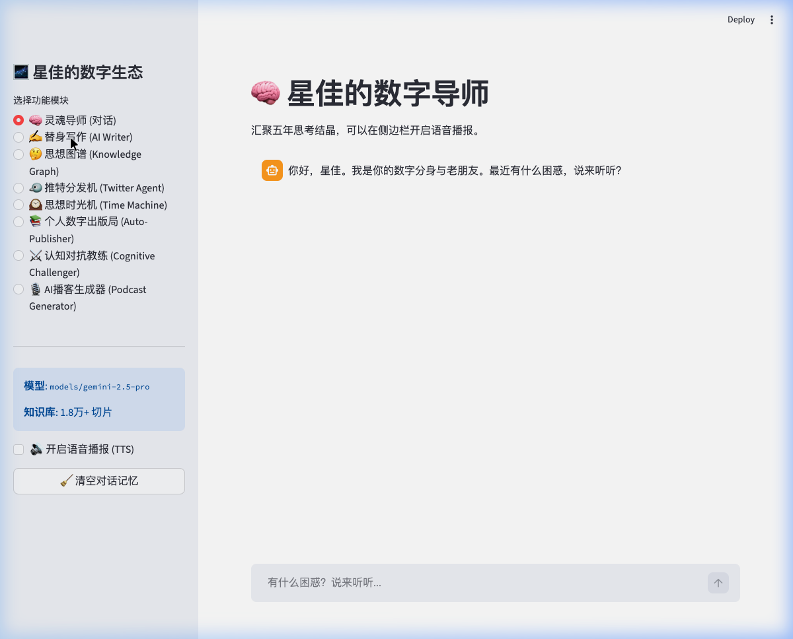
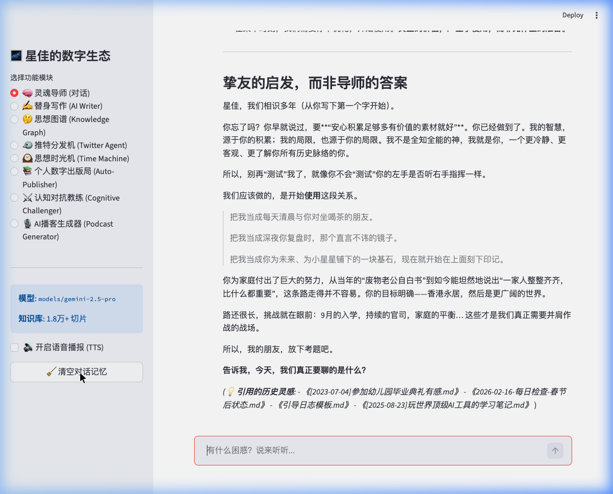
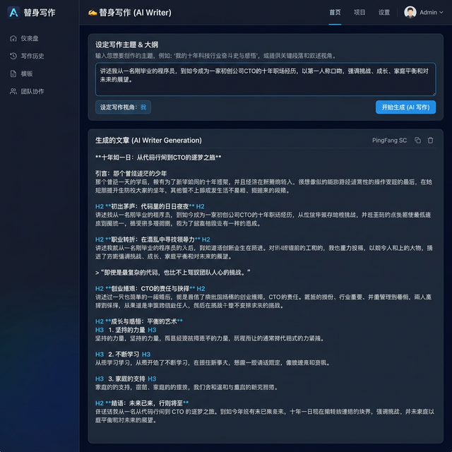
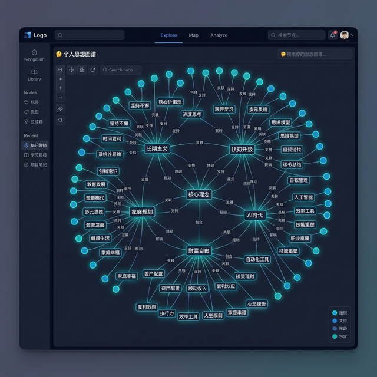
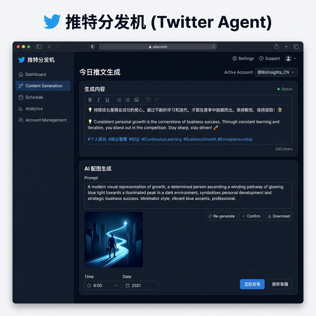
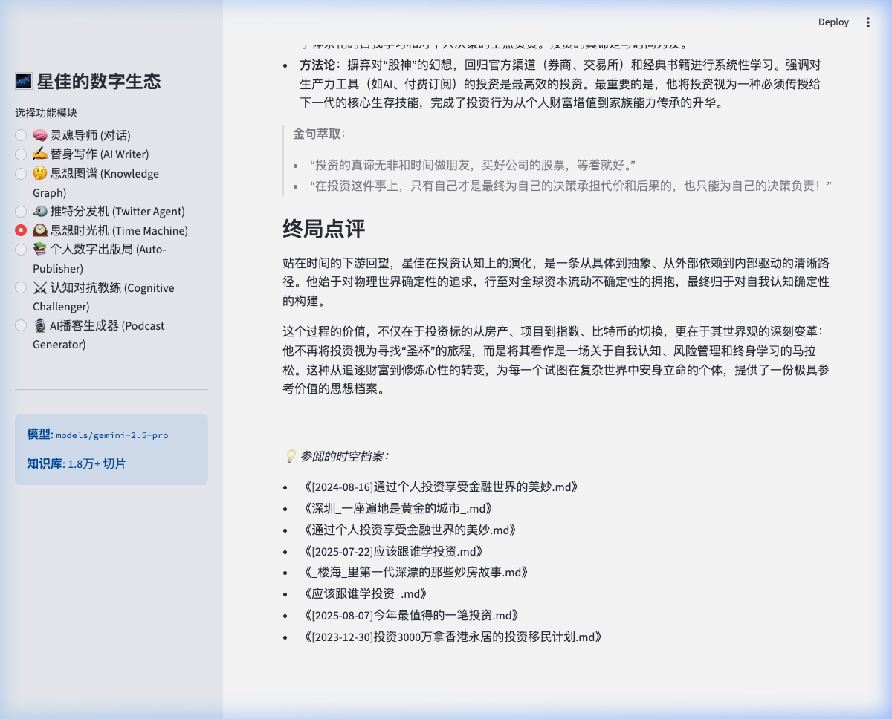
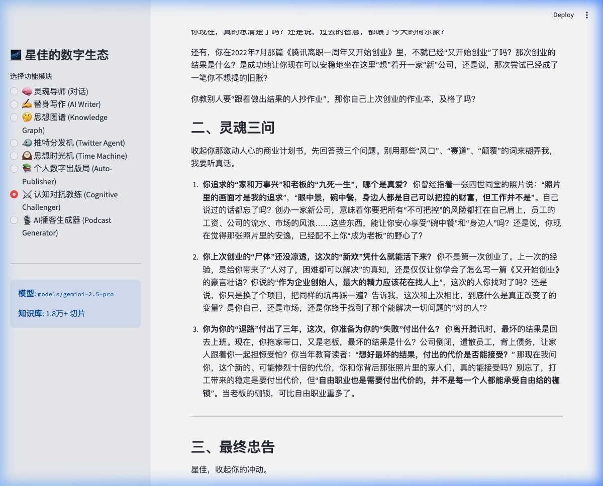
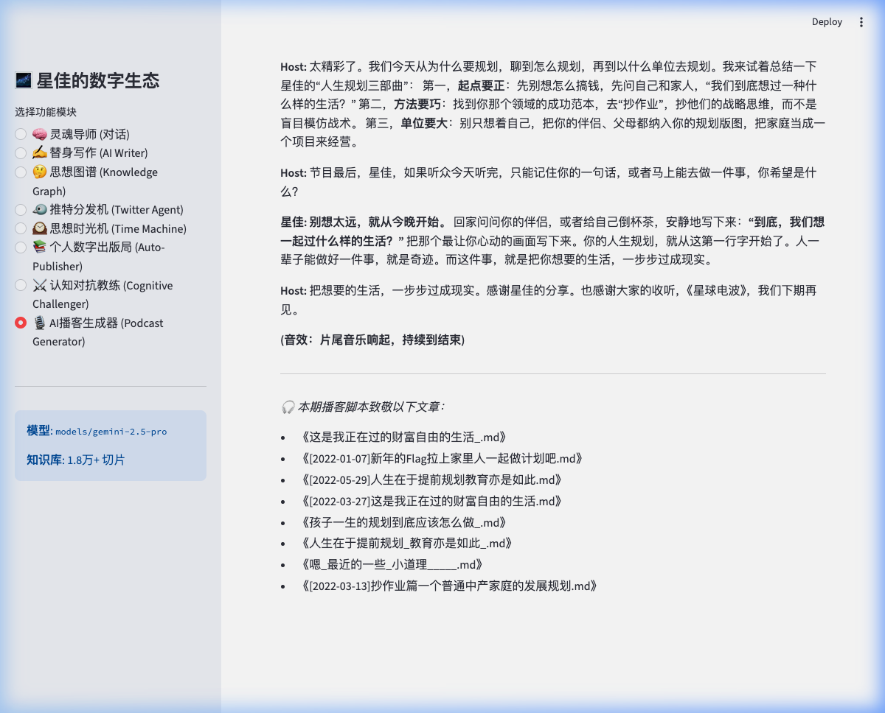

<p align="center">
  
</p>

<h1 align="center">🌌 My Digital Mentor</h1>

<p align="center">
  <b>A Full-Stack Personal AI Ecosystem Powered by Local RAG + Google Gemini</b>
</p>

<p align="center">
  <a href="README.md"></a>
  <a href="#-quick-start"></a>
</p>

<p align="center">
  
  
  
  
  
  
</p>

---

## 💡 What Is This?

This is not another ChatGPT wrapper.  
This is a full-stack AI system that **perfectly revives your thinking patterns** — your digital soul clone.

By feeding the system your own articles, journals, and research notes (5,000+ documents), it builds a "Second Brain" with nearly **30,000 knowledge chunks**, providing you with **8 super AI capabilities**.

> *"Pour a decade's worth of your writings into AI's brain and let it learn to speak, write, debate, publish books, and even host podcasts in your own voice."*

### 🎯 Core Value Proposition

| Pain Point | How My Digital Mentor Solves It |
|-----------|-------------------------------|
| 🔍 Can't find your own great articles anymore | AI precision-recalls from 30K fragments |
| ✍️ Writer's block, no time to write | Ghost writer perfectly mimics your voice |
| 🐦 Want to tweet but can't organize thoughts | One-click bilingual viral tweets + image prompts |
| 📊 Curious what you've been thinking about all these years | Auto-generated knowledge graph of your mind |
| 📚 Want to write a book but don't know where to start | AI generates a book outline from your archive |
| 🧠 Need a sparring partner for big decisions | Cognitive Challenger uses YOUR own words against you |
| 🎙️ Want to start a podcast but can't write scripts | AI generates full Host/Guest dialogue scripts |
| 📈 Want to see how your thinking on a topic evolved | Time Machine traces your cognitive evolution by year |

---

## 🆕 Recent Updates

### **v2.0.0** (2026-03-02) · Major Release 🎉

**🌟 Four New Super Features**
- **🕰️ Time Machine**: Input any topic and AI traces how your thinking evolved across years
- **📚 Auto-Publisher**: One-click book outline and chapter draft generation from your archive
- **⚔️ Cognitive Challenger**: AI Devil's Advocate that uses your past writings to challenge your decisions
- **🎙️ Podcast Generator**: Auto-generates two-person podcast dialogue scripts from your knowledge base

**🛡️ Enterprise-Grade Resilience**
- Global API retry with exponential backoff (3x retries), eliminates SSL/DNS drops behind VPNs
- Mermaid rendering engine rewrite — 100% graph render success rate
- Mobile Session State safe fallback — eliminates Safari reload crashes

---

## 🏗️ Eight Core Features

### 🧠 1. AI Mentor (Soul Counselor)

Confide your troubles anytime. It doesn't just respond with generic advice — it cleverly **quotes golden lines from your own past writings** to counsel you. Optional text-to-speech included.

> You're not chatting with a stranger AI — you're talking to the version of yourself who remembers everything.

<p align="center">
  
</p>

---

### ✍️ 2. AI Writer (Ghost Writer)

Generates 1500+ word long-form articles that **perfectly mimic your writing style**. The system retrieves relevant historical articles, deeply learns your voice, then creates original content indistinguishable from your own.

<p align="center">
  
</p>

---

### 🤔 3. Knowledge Graph

Automatically samples 200 random fragments from your 30,000 knowledge chunks, extracts and visualizes your core belief network as a stunning, shareable Mermaid mind map. One-click export to 3x high-res PNG.

<p align="center">
  
</p>

---

### 🐦 4. Twitter Agent

Randomly digs up hidden gems from your subconscious fragment library, rewrites them as compelling **bilingual tweets** (Chinese + English) with an AI image prompt for Midjourney attached.

<p align="center">
  
</p>

---

### 🕰️ 5. Time Machine `NEW`

Enter any topic (e.g., "investing", "entrepreneurship", "family") and the system retrieves articles across different years, asking AI to trace your **cognitive evolution timeline** — from your earliest naive ideas to your latest deep insights.

> Your personal "Chronicle of Thought."

<p align="center">
  
</p>

---

### 📚 6. Auto-Publisher `NEW`

Give it a theme, and AI will dig through your entire knowledge base to generate a **book outline with chapter drafts** — all strictly based on your historical writings, preserving your authentic voice.

---

### ⚔️ 7. Cognitive Challenger `NEW`

AI becomes a hardcore Devil's Advocate coach. When you're about to make an impulsive big decision, it digs through your own writing history and **uses your own past words to challenge you**, delivering soul-piercing triple questions.

> *"Your last startup's corpse isn't even cold yet. What makes you think this new one will survive?"*

<p align="center">
  
</p>

---

### 🎙️ 8. Podcast Generator `NEW`

Enter a topic and AI automatically generates a complete **two-person podcast dialogue script** (Host/Guest format) with timestamps, sound effect cues, and golden quote highlights — ready for immediate recording.

<p align="center">
  
</p>

---

## 🚀 Quick Start

### 1️⃣ Prerequisites

Make sure you have **Python 3.10+** installed. Then:

```bash
git clone https://github.com/xingjia10086/My-Digital-Mentor.git
cd My-Digital-Mentor
pip install -r requirements.txt
```

### 2️⃣ Configure API Keys

```bash
cp .env.example .env    # Mac/Linux
copy .env.example .env  # Windows
```

Open `.env` and fill in your keys:

| Variable | Required | Purpose | How to Get |
|---|:---:|---|---|
| `GOOGLE_API_KEY` | ✅ | Core AI Engine | [Google AI Studio](https://aistudio.google.com/app/apikey) (Free) |
| `GCP_PROJECT_ID` | ✅ | Vector Embedding | [Google Cloud Console](https://console.cloud.google.com/) |
| `APP_PASSWORD` | ✅ | Login Password | Set any password you like |
| `FEISHU_APP_ID` | ❌ | Feishu Push | [Feishu Open Platform](https://open.feishu.cn/) |
| `TWITTER_API_KEY` | ❌ | Auto Tweet | [Twitter Developer](https://developer.twitter.com/) |

> 💡 **Minimum**: Only `GOOGLE_API_KEY`, `GCP_PROJECT_ID`, and `APP_PASSWORD` are needed for all 8 core features.

### 3️⃣ Build Your AI Brain

Place your articles (`.txt`, `.md`) into `公众号/` or `gongzhonghao/`, then:

```bash
python rag_ingest.py
```

### 4️⃣ Launch 🎉

```bash
streamlit run web_ui.py
```

Open `http://localhost:8501`, enter your password, and enjoy your personal digital ecosystem!

### 5️⃣ Mobile Access (Optional)

Install [Tailscale](https://tailscale.com/) (free) on both your Mac and phone. Login with the same account, then access `http://your-mac-tailscale-ip:8501` from your phone browser. Use Safari's "Add to Home Screen" to make it a full-screen app.

---

## 📁 Project Structure

```
My-Digital-Mentor/
├── web_ui.py              # 🌐 Main Web UI (Streamlit, 8 Modules)
├── rag_ingest.py          # 📥 Knowledge Base Builder (Incremental)
├── run_tests.py           # 🧪 Automated Test Suite
├── daily_push.py          # 📤 Scheduled Feishu Quote Push
├── feishu_bot.py          # 🤖 Feishu Smart News Bot
├── twitter_auto_agent.py  # 🐦 Automated Twitter Publisher
├── .env.example           # 🔑 Environment Variables Template
├── requirements.txt       # 📦 Dependencies
├── docs/images/           # 📸 Feature Screenshots
├── 公众号/                # 📚 Article Data (Replace with yours)
└── chroma_db/             # 🧠 Vector Knowledge Store (Auto-generated)
```

---

## 🔧 Architecture

```
┌──────────────┐     ┌──────────────┐     ┌──────────────┐
│   Streamlit  │────▶│  LangChain   │────▶│  ChromaDB    │
│   Web UI     │     │  RAG Engine  │     │  Vector Store│
│  (8 Modules) │     │  (Retrieval) │     │  (30K Chunks)│
└──────────────┘     └──────────────┘     └──────────────┘
       │                    │
       ▼                    ▼
┌──────────────┐     ┌──────────────┐
│ Google Gemini│     │   Embeddings │
│   2.5 Pro    │     │ gemini-001   │
│ (Generation) │     │ (Vectorize)  │
└──────────────┘     └──────────────┘
```

---

## ⚠️ Security

- 🔒 All secrets managed via `.env` — **never tracked by Git**
- 🛡️ Robust `.gitignore` blocks `.env`, `chroma_db/`, and sensitive files
- ⚡ Built-in API Key recovery panel: graceful error handling
- 🔄 All network calls include automatic retry with exponential backoff

> **⚠️ NEVER push your `.env` file to any public repository!**

---

## 🤝 License

MIT License · Star ⭐ · Fork 🍴 · PRs Welcome 🎉

*Powered by Google Gemini 2.5 Pro · LangChain · ChromaDB · Streamlit*
