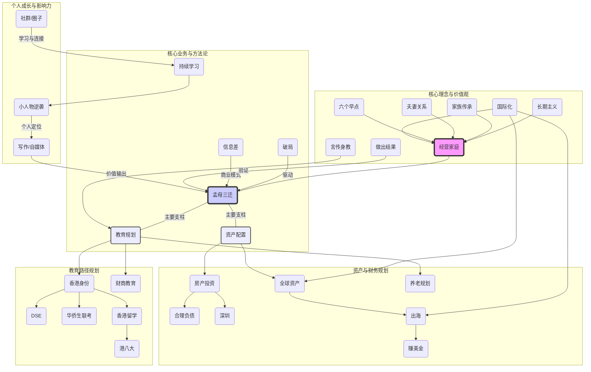

# 星佳的个人思想图谱

（由 AI 随机抓取历史片段生成的核心词汇逻辑关系）

```mermaid
graph TD
    subgraph 核心理念与价值观
        A(经营家庭)
        B(长期主义)
        C(家族传承)
        D(夫妻关系)
        E(做出结果)
        F(言传身教)
        G(六个早点)
        H(国际化)
    end

    subgraph 核心业务与方法论
        I(孟母三迁)
        J(教育规划)
        K(资产配置)
        L(破局)
        M(信息差)
        N(持续学习)
    end

    subgraph 教育路径规划
        O(香港身份)
        P(DSE)
        Q(华侨生联考)
        R(香港留学)
        S(港八大)
        T(财商教育)
    end

    subgraph 资产与财务规划
        U(房产投资)
        V(全球资产)
        W(合理负债)
        X(深圳)
        Y(出海)
        Z(赚美金)
        AA(养老规划)
    end

    subgraph 个人成长与影响力
        BB(小人物逆袭)
        CC(写作/自媒体)
        DD(社群/圈子)
    end

    %% 核心关系连接
    B --> A
    C --> A
    D --> A
    A --- I

    I -- 主要支柱 --- J
    I -- 主要支柱 --- K
    
    L -- 驱动 --> I
    M -- 商业模式 --> I
    E -- 验证 --> I
    
    %% 理念与行动的连接
    F --> J
    G --> A
    H --> A
    H --> Y
    H --> V

    %% 个人成长与核心业务连接
    BB -- 个人定位 --> CC
    N --> BB
    DD -- 学习与连接 --> N
    CC -- 价值输出 --> I

    %% 教育规划分支
    J --> O
    J --> T
    J --> AA
    O --> P
    O --> Q
    O --> R
    R --> S

    %% 资产配置分支
    K --> U
    K --> V
    U --> W
    U --> X
    V --> Y
    Y --> Z

    %% 设定中心节点样式
    style A fill:#f9f,stroke:#333,stroke-width:4px
    style I fill:#ccf,stroke:#333,stroke-width:4px
    style J fill:#lightgreen,stroke:#333,stroke-width:2px
    style K fill:#lightyellow,stroke:#333,stroke-width:2px
```