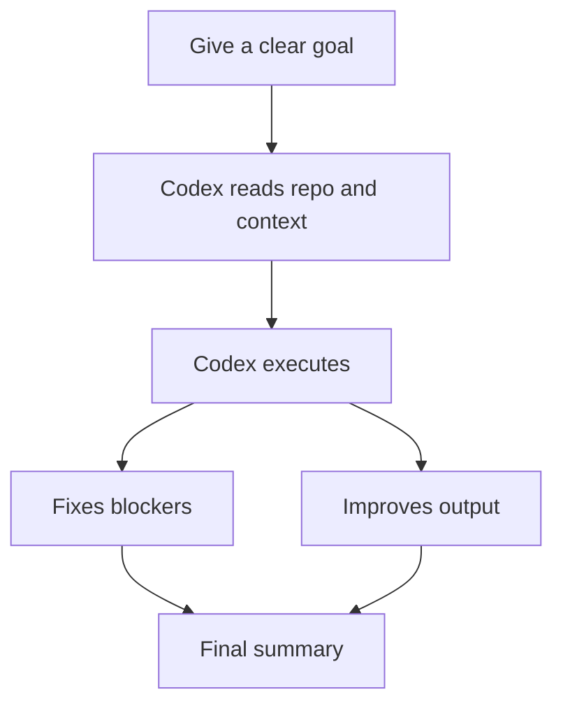
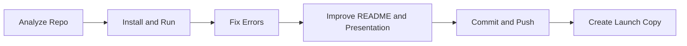
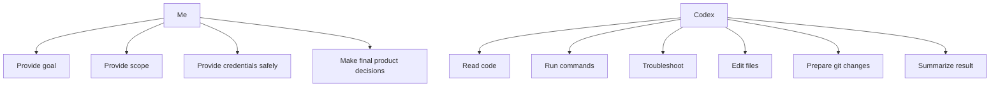

# TechMe

> My personal Codex playbook for deployment, troubleshooting, GitHub growth, and shipping work faster.

---

## Table of Contents

- [1. What Codex Should Be For Me](#1-what-codex-should-be-for-me)
- [2. My Core Principle](#2-my-core-principle)
- [3. My Best Working Loop](#3-my-best-working-loop)
- [4. The 4-Part Prompt Formula](#4-the-4-part-prompt-formula)
- [5. My Default Control Phrases](#5-my-default-control-phrases)
- [6. Visual Workflow Map](#6-visual-workflow-map)
- [7. My Personal SOP](#7-my-personal-sop)
- [8. My High-Frequency Prompt Library](#8-my-high-frequency-prompt-library)
- [9. Better Prompting Examples](#9-better-prompting-examples)
- [10. What To Avoid](#10-what-to-avoid)
- [11. Security Habit](#11-security-habit)
- [12. My One-Page Battle Card](#12-my-one-page-battle-card)
- [13. My Real Use Cases](#13-my-real-use-cases)
- [14. Quick Copy Templates](#14-quick-copy-templates)
- [15. Final Reminder](#15-final-reminder)

---

## 1. What Codex Should Be For Me

I should not treat Codex like a normal chatbot.

For my workflow, Codex is best used as:

- a technical executor
- a deployment troubleshooter
- a repo operator
- a GitHub packaging assistant
- a README and launch copy writer
- a code reviewer

That means the most useful questions are not:

- "What do you think?"
- "Can you take a look?"
- "How should I optimize this?"

The most useful requests are:

- "Get this repo running locally."
- "Rewrite this README to improve star conversion."
- "Push this work to GitHub."
- "Fix the startup issue and verify it."

---

## 2. My Core Principle

The highest-value way to use Codex is:

> Do not ask Codex how to do the work.  
> Ask Codex to directly do the work.

That one shift changes everything.

---

## 3. My Best Working Loop

For the kind of work I usually do, this is the ideal loop:

```text
Analyze repo -> Run project -> Fix blockers -> Improve presentation -> Push to GitHub -> Create launch copy
```

This is the workflow I should default to.

---

## 4. The 4-Part Prompt Formula

Whenever I want Codex to perform well, I should use this structure:

```text
Goal: <final result>
Scope: <what can be changed / what cannot be changed>
Standard: <success criteria>
Execution: directly do the work, don't stop at analysis; troubleshoot first; end with result, risk, and next step
```

### Example

```text
Goal: Deploy this repository locally and run it
Scope: You can install dependencies, change config, and adjust scripts, but do not change core business logic
Standard: The project must be locally accessible and the startup path must be clear
Execution: Directly do the work, don't stop at analysis; troubleshoot first; report result, risk, and next step
```

This format is simple, but it gives Codex:

- a target
- a boundary
- a quality bar
- an execution mode

---

## 5. My Default Control Phrases

These short phrases are high leverage and should be reused often:

- `Directly do it, don't just analyze`
- `Troubleshoot first before asking me`
- `Do not stop at suggestions`
- `Try to finish the whole chain`
- `Only change files related to this task`
- `Do not include unrelated git changes`
- `At the end, only give me result, risk, and next step`

These phrases help Codex stay in execution mode instead of drifting into generic advice.

---

## 6. Visual Workflow Map

### Simple Flow



### Repo Shipping Flow



### What I Should Own vs What Codex Should Own



---

## 7. My Personal SOP

### SOP 1: Taking Over a New Repo

Use this when I first enter an unfamiliar repository.

```text
Analyze this repository and take it over.
Identify the stack, entrypoints, startup flow, and risks, then install dependencies and run it.
If there are problems, troubleshoot them first.
At the end, tell me the structure, how to run it, the access URL, and remaining blockers.
```

### SOP 2: Fix a Broken Project

Use this when the project does not run.

```text
Get this project to a runnable state.
You can change config, dependencies, and scripts, but do not change core business logic.
Directly do the work instead of only analyzing.
At the end, tell me root cause, changes made, and verification result.
```

### SOP 3: Improve GitHub Star Conversion

Use this when the project needs better packaging and positioning.

```text
Package this repository into a stronger open-source project for GitHub.
Only change README, docs, and presentation copy. Do not change core code.
I want stronger positioning, screenshots, better structure, and launch copy.
Directly implement the changes.
```

### SOP 4: Push Clean Changes to GitHub

Use this when I want a clean shipping workflow.

```text
Prepare this work cleanly and push it to GitHub.
Only commit files related to this task.
Do not include unrelated changes or sensitive files.
If there are auth or git issues, troubleshoot them first.
```

### SOP 5: Productize a Demo

Use this when something works technically but feels unfinished.

```text
Turn this project from a demo into something that feels like a real product.
Keep the existing functionality, but improve UX, writing, layout, and presentation.
Directly modify the code and final assets.
```

---

## 8. My High-Frequency Prompt Library

These are the prompts I should reuse the most.

### 1. Analyze a Repo

```text
Analyze this repository and tell me the tech stack, startup path, key entry files, and biggest risks.
Look at the code first before concluding.
```

### 2. Deploy a Repo

```text
Deploy this repository locally, install dependencies, and run it.
If anything breaks, troubleshoot it first.
At the end, tell me the access URL and remaining risks.
```

### 3. Fix Startup Errors

```text
Fix this project's startup issues.
You can adjust config, scripts, and dependencies, but do not change core business logic.
Do the work directly instead of stopping at analysis.
```

### 4. Review for Bugs

```text
Review this repo or PR.
Prioritize bugs, regressions, and missing tests.
Do not start with praise. List findings first by severity.
```

### 5. Rewrite README

```text
Rewrite this project's README to improve GitHub star conversion.
Only change documentation, not core code.
Make it feel more like a real product page.
```

### 6. Build Bilingual README

```text
Create stronger Chinese and English README files based on the real capabilities of this project.
They should be honest, productized, and visually structured.
```

### 7. Add Screenshots to README

```text
Use the existing screenshot assets to improve the README layout.
Make the page more visual and more shareable.
```

### 8. Generate GitHub Growth Assets

```text
Based on the actual project functionality, give me GitHub About text, Topics, an English launch post, and a Chinese launch post.
Make everything directly copyable.
```

### 9. Productize the Frontend

```text
Make this front-end feel more like a finished product and less like a demo.
Keep the same functionality, but improve hierarchy, copy, and visual polish.
```

### 10. Push to GitHub

```text
Cleanly prepare these changes, commit only the related files, and push them to GitHub.
If there are git or auth issues, troubleshoot them first.
```

### 11. Continue Working

```text
Continue. Do not stop at analysis. Finish the task chain.
```

### 12. Final Summary Format

```text
At the end, only tell me:
1. what you changed
2. what you verified
3. what risks remain
4. what I should do next
```

---

## 9. Better Prompting Examples

### Weak Version

```text
Help me optimize this project.
```

### Strong Version

```text
Improve this repository's GitHub star conversion.
Only change README, docs, and presentation copy.
I want stronger positioning, screenshots, better section structure, and launch copy.
Directly implement the changes and summarize the final results.
```

### Weak Version

```text
Can you check why it fails?
```

### Strong Version

```text
Get this project to a runnable state.
You can change config, dependencies, and scripts, but do not change core business logic.
Troubleshoot the failure, fix the root cause, and verify the app starts successfully.
```

The strong versions work because they remove ambiguity.

---

## 10. What To Avoid

Avoid prompts like:

- `help me check this`
- `what do you think`
- `can you optimize it`
- `take a look`

Avoid giving only background with no requested result.

Avoid interrupting Codex too early when it is already progressing correctly.

Avoid exposing secrets in chat if local terminal input would work.

---

## 11. Security Habit

When credentials are needed, I should prefer:

- entering tokens in my own local terminal
- using short-lived or scoped tokens
- rotating anything accidentally exposed
- never committing `.env`, tokens, or local databases

If a secret was pasted into chat, I should assume it is burned and rotate it.

---

## 12. My One-Page Battle Card

### The 5 Rules

```text
1. Start with the result
2. Define the boundaries
3. Tell Codex to execute directly
4. Let it finish the chain
5. Ask for result / risk / next step
```

### Battle Card Template

```text
Goal: <final result>
Scope: <allowed changes / forbidden changes>
Standard: <success criteria>
Execution: directly do the work, don't stop at analysis; troubleshoot first; end with result, risk, and next step
```

### Daily Default Instruction

```text
Directly do the work, don't just analyze.
Troubleshoot problems first.
Only change files related to this task.
At the end, report result, risk, and next step.
```

---

## 13. My Real Use Cases

These are the most practical ways I personally should use Codex.

### Use Case A: Run a New Project Fast

Goal:

- understand the repo
- install dependencies
- run locally
- fix startup blockers

Best prompt:

```text
Analyze this repository, install dependencies, and get it running locally.
If anything blocks startup, troubleshoot it first.
At the end, tell me the access URL, startup command, and remaining risks.
```

### Use Case B: Make a Repo More Star-Worthy

Goal:

- stronger README
- better screenshots
- clearer value proposition
- better launch copy

Best prompt:

```text
Package this repository into a stronger GitHub project for star growth.
Only change README, docs, and presentation copy.
I want stronger positioning, better visual structure, and launch-ready copy.
```

### Use Case C: Push Clean Work to GitHub

Goal:

- commit only the right files
- avoid pushing junk
- solve auth issues

Best prompt:

```text
Prepare this work cleanly, commit only task-related files, and push it to GitHub.
Do not include unrelated changes or sensitive files.
If auth or git problems appear, troubleshoot them first.
```

### Use Case D: Turn a Demo into a Product

Goal:

- improve UX
- improve copy
- improve visual hierarchy
- preserve working logic

Best prompt:

```text
Turn this project from a demo into something that feels like a real product.
Keep the same functionality, but improve the front-end, copy, and presentation.
```

---

## 14. Quick Copy Templates

### Universal Long Template

```text
Goal: <result>
Scope: <what can and cannot be changed>
Standard: <success criteria>
Execution: directly do the work, don't stop at analysis; troubleshoot first; end with result, risk, and next step
```

### Universal Short Template

```text
Directly do the work, don't just analyze.
Troubleshoot first.
Only change related files.
At the end, give me result, risk, and next step.
```

### My Best 5 Prompts

#### Prompt 1

```text
Get this project running locally. If something fails, troubleshoot it first. Then tell me the access URL and remaining risks.
```

#### Prompt 2

```text
Package this repository into a stronger GitHub project for star growth. Only change README, docs, and presentation copy.
```

#### Prompt 3

```text
Analyze repo -> run it -> fix problems -> improve README -> push to GitHub. Directly do the work, don't stop at analysis.
```

#### Prompt 4

```text
Review this code and prioritize bugs, regressions, and missing tests. List findings first by severity.
```

#### Prompt 5

```text
Create launch materials for this project: GitHub About, Topics, English launch post, Chinese launch post, and a short demo video script.
```

---

## 15. Final Reminder

If I use Codex well, it becomes less like a chatbot and more like a hands-on technical partner.

My ideal collaboration mode is:

- clear goal
- clear scope
- direct execution
- low interruption
- concise final summary

That is the whole operating system.
