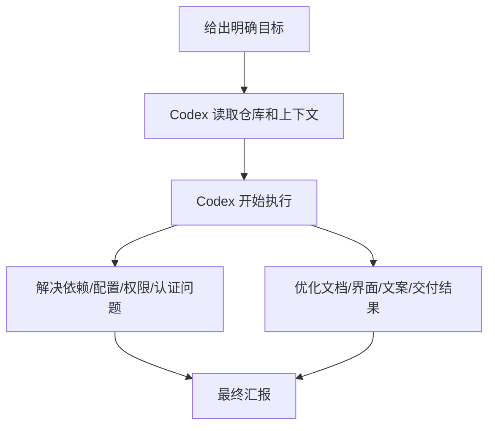
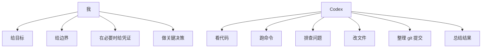

# TechMe 中文版

> 这是我给自己写的 Codex 个人使用手册。  
> 目标不是“学会聊天”，而是“把 Codex 变成真正能帮我推进项目的技术搭档”。

---

## 目录

- [1. 我应该怎么定位 Codex](#1-我应该怎么定位-codex)
- [2. 最重要的一条原则](#2-最重要的一条原则)
- [3. 我最适合的工作流](#3-我最适合的工作流)
- [4. 最好用的提问公式](#4-最好用的提问公式)
- [5. 我应该常说的控制语句](#5-我应该常说的控制语句)
- [6. 可视化工作流程](#6-可视化工作流程)
- [7. 适合我的个人 SOP](#7-适合我的个人-sop)
- [8. 高频提示词库](#8-高频提示词库)
- [9. 怎样提问会明显更高效](#9-怎样提问会明显更高效)
- [10. 我最该避免的低效问法](#10-我最该避免的低效问法)
- [11. 安全习惯](#11-安全习惯)
- [12. 我的作战卡片](#12-我的作战卡片)
- [13. 我的真实使用场景](#13-我的真实使用场景)
- [14. 一键复制模板](#14-一键复制模板)
- [15. 最后的提醒](#15-最后的提醒)

---

## 1. 我应该怎么定位 Codex

我不应该把 Codex 当成普通聊天机器人。

对我来说，Codex 最适合扮演这几种角色：

- 技术执行者
- 部署排障助手
- 仓库接管者
- GitHub 增长包装助手
- README 和宣传文案写手
- 代码审查员

也就是说，我最不应该做的事是一直问：

- “你觉得怎么样？”
- “帮我看看？”
- “这个项目怎么优化？”

我最应该做的事是直接下达结果型任务：

- “把这个仓库本地跑起来”
- “把这个 README 改成更适合拉星”
- “把这次合作成果推到 GitHub”
- “修掉这个启动报错并验证”

一句话总结：

> **Codex 最强的地方不是陪我聊天，而是替我动手。**

---

## 2. 最重要的一条原则

我用 Codex 时最核心的一条原则就是：

> 不要总问它“怎么做”。  
> 要更多地让它“直接去做”。

这个差别非常大。

如果我总是问“你建议怎么做”，得到的通常是建议。  
如果我说“直接做”，得到的通常是结果。

---

## 3. 我最适合的工作流

按我现在最常见的工作方式，最适合我的完整链路是：

```text
分析仓库 -> 本地跑起来 -> 修问题 -> 优化 README/展示 -> 推到 GitHub -> 生成宣传素材
```

这就是我的高价值默认工作流。

以后我只要接触一个新项目，优先考虑让 Codex 按这条链路去推进。

---

## 4. 最好用的提问公式

以后我发任务，尽量按这个结构来：

```text
目标：<最终结果>
范围：<允许改什么 / 不允许改什么>
标准：<成功标准>
执行方式：直接动手，不要只分析；遇到问题先自己排查；最后汇报结果、风险、下一步
```

### 示例

```text
目标：把这个仓库本地跑起来
范围：允许安装依赖、改配置、改脚本；不要改核心业务逻辑
标准：本地可以访问，启动方式清晰
执行方式：直接动手，不要只分析；遇到问题先自己排查；最后告诉我结果、风险和下一步
```

这个公式的好处是，它同时告诉 Codex 四件事：

- 我要什么结果
- 它能动哪里
- 什么叫成功
- 它应该怎么工作

---

## 5. 我应该常说的控制语句

下面这些话很短，但非常有用，我应该反复使用：

- `直接动手，不要只分析`
- `遇到问题先自己排查`
- `不要停在建议`
- `尽量把整条链路做完`
- `只改和当前任务相关的文件`
- `不要把无关 git 改动带进去`
- `最后只告诉我结果、风险和下一步`

这些话的作用是把 Codex 维持在“执行模式”，而不是“泛泛讨论模式”。

---

## 6. 可视化工作流程

### 基础流程图



### 我最常用的项目推进流程


### 我和 Codex 的职责分工



---

## 7. 适合我的个人 SOP

### SOP 1：接手一个新仓库

适用于：

- 刚 clone 一个项目
- 不清楚技术栈
- 想尽快进入可执行状态

直接这样说：

```text
分析这个仓库并接管它。
先识别技术栈、关键入口文件、启动方式和风险，然后安装依赖并运行。
遇到问题自己先排查。
最后告诉我：项目结构、启动方式、访问地址、剩余阻塞。
```

---

### SOP 2：修一个跑不起来的项目

适用于：

- 报错太多
- 环境不对
- 依赖链路有问题

直接这样说：

```text
把这个项目修到可运行。
可以改配置、依赖、脚本，但不要改核心业务逻辑。
直接动手，不要只分析。
最后告诉我根因、改了什么、验证结果。
```

---

### SOP 3：优化 GitHub 仓库，提升 star 转化

适用于：

- README 太弱
- 仓库看起来像 demo
- 缺少传播文案和截图结构

直接这样说：

```text
把这个仓库包装成更适合 GitHub 拉星的开源项目。
只改 README、docs、展示文案，不改核心代码。
我需要更强的定位、截图、结构和宣传文案。
直接做完。
```

---

### SOP 4：整理并推到 GitHub

适用于：

- 当前已经有改动
- 我想干净地提交和推送

直接这样说：

```text
把这次工作整理干净并推到 GitHub。
只提交当前任务相关文件。
不要把无关改动和敏感文件带进去。
遇到 git 或认证问题自己先排查。
```

---

### SOP 5：把 demo 升级成产品

适用于：

- 功能有了，但不够产品化
- 页面太像原型或实验品

直接这样说：

```text
把这个项目从 demo 提升成更像正式产品的状态。
保持现有功能逻辑，重点优化前端体验、文案、结构和展示效果。
直接改代码和相关文档。
```

---

## 8. 高频提示词库

下面这些是我以后最应该反复复用的提示词。

### 1. 分析仓库

```text
分析这个仓库，告诉我技术栈、启动方式、关键入口文件和最大风险点。
先看代码再下结论。
```

### 2. 本地部署

```text
把这个仓库本地部署起来，安装依赖并运行。
如果有问题先自己排查。
最后告诉我访问地址和剩余风险。
```

### 3. 修启动错误

```text
修这个项目当前的启动问题。
允许改配置、脚本和依赖，但不要改核心业务逻辑。
直接动手，不要停在分析。
```

### 4. 做代码 review

```text
review 这个仓库或 PR。
优先找 bug、回归风险和缺失测试。
不要先夸，先按严重程度列问题。
```

### 5. 重写 README

```text
重写这个项目的 README，让它更适合 GitHub 拉 star。
只改文档，不改核心代码。
要更像成熟产品页。
```

### 6. 做中英文 README

```text
根据项目真实能力，同时优化中文 README 和英文 README。
要求真实、不夸张、更有产品感、更适合传播。
```

### 7. 用截图优化 README

```text
利用仓库现有截图资源优化 README 排版。
让页面更有美感，更适合社交传播和 GitHub 展示。
```

### 8. 生成 GitHub 增长素材

```text
根据这个项目的真实功能，给我 GitHub About、Topics、英文首发帖、中文首发帖。
要求全部可直接复制使用。
```

### 9. 产品化前端

```text
把这个前端页面改得更像正式产品，而不是 demo。
保持功能逻辑不变，重点优化层次、文案和视觉完成度。
```

### 10. 推到 GitHub

```text
整理这次改动，只提交相关文件并推到 GitHub。
如果遇到 git 或认证问题，先自己排查再处理。
```

### 11. 继续推进

```text
继续，不要停在分析，直接把整条链路做完。
```

### 12. 最终汇报格式

```text
最后只告诉我：
1. 改了什么
2. 验证了什么
3. 还剩什么风险
4. 我下一步该做什么
```

---

## 9. 怎样提问会明显更高效

### 低效问法

```text
帮我优化一下这个项目。
```

### 高效问法

```text
提升这个仓库的 GitHub star 转化率。
只改 README、docs 和展示文案。
我要更强的定位、截图结构、功能表达和首发文案。
直接改文件并给我最终可发布版本。
```

---

### 低效问法

```text
你看看为什么报错。
```

### 高效问法

```text
把这个项目修到可运行状态。
允许改配置、依赖和脚本，不要改核心业务逻辑。
先定位根因，再修复并验证。
```

为什么高效问法更强？

因为它明确了：

- 目标
- 边界
- 成功标准
- 执行方式

---

## 10. 我最该避免的低效问法

以后尽量少说这些：

- `帮我看看`
- `你觉得呢`
- `怎么优化比较好`
- `你分析一下`
- `你有什么建议`

这些话不是不能用，而是它们太容易把 Codex引向“建议模式”，而不是“执行模式”。

我真正要的是结果，不是建议本身。

---

## 11. 安全习惯

以后涉及凭证时，我应该优先这样做：

- 尽量在本机终端手动输入 token
- 尽量使用短期 token 或最小权限 token
- 一旦把密钥发进聊天，就默认它已经暴露
- `.env`、token、本地数据库不要提交到仓库

一句话：

> **发出去的 secret，就当它已经不安全。**

---

## 12. 我的作战卡片

### 五条核心规则

```text
1. 先说我要的结果
2. 再说能改什么、不能改什么
3. 明确要求直接执行
4. 让 Codex 尽量做完整条链路
5. 最后只要结果、风险、下一步
```

### 作战卡片模板

```text
目标：<最终结果>
范围：<允许改什么 / 禁止改什么>
标准：<成功标准>
执行方式：直接动手，不要只分析；遇到问题先自己排查；最后汇报结果、风险、下一步
```

### 我的默认开场白

```text
直接动手，不要只分析。
遇到问题先自己排查。
只改和当前任务相关的内容。
最后告诉我结果、风险和下一步。
```

---

## 13. 我的真实使用场景

下面这些是最适合我的真实场景。

### 场景 A：快速跑一个新项目

目标：

- 看懂仓库
- 安装依赖
- 启动项目
- 修掉阻塞问题

最优提示词：

```text
分析这个仓库，安装依赖并本地跑起来。
如果有任何阻塞，先自己排查并修复。
最后告诉我访问地址、启动命令和剩余风险。
```

---

### 场景 B：让仓库更容易拿 star

目标：

- 强化 README
- 加截图
- 优化卖点表达
- 输出传播素材

最优提示词：

```text
把这个仓库包装成更容易拿 star 的开源项目。
只改 README、docs 和展示文案。
我要更强的定位、更好的视觉结构和可直接发布的宣传文案。
```

---

### 场景 C：干净推送到 GitHub

目标：

- 只提交相关文件
- 不把垃圾带上去
- 认证问题也一并处理

最优提示词：

```text
把这次工作整理干净，只提交当前任务相关文件并推到 GitHub。
不要带无关改动和敏感文件。
遇到 git 或认证问题先自己处理。
```

---

### 场景 D：把 demo 做成产品感更强的作品

目标：

- 更好的前端体验
- 更好的视觉层次
- 更好的产品表达

最优提示词：

```text
把这个项目从 demo 提升成更像正式产品的状态。
保持功能逻辑不变，重点优化前端、文案和展示效果。
```

---

## 14. 一键复制模板

### 万能长模板

```text
目标：<结果>
范围：<允许改什么 / 不允许改什么>
标准：<成功标准>
执行方式：直接动手，不要只分析；遇到问题先自己排查；最后汇报结果、风险、下一步
```

### 万能短模板

```text
直接动手，不要只分析。
遇到问题先自己排查。
只改相关文件。
最后给我结果、风险和下一步。
```

### 我最值得长期保存的 5 条提示词

#### 提示词 1

```text
把这个项目本地跑起来，遇到问题自己修，最后告诉我访问地址和剩余风险。
```

#### 提示词 2

```text
把这个仓库包装成更适合 GitHub 拉 star 的开源项目，只改 README、docs 和展示文案。
```

#### 提示词 3

```text
分析仓库 -> 跑起来 -> 修问题 -> 优化 README -> 推到 GitHub，直接做完，不要停在分析。
```

#### 提示词 4

```text
review 这段代码，优先找 bug、回归风险和缺失测试，按严重程度列问题。
```

#### 提示词 5

```text
根据项目真实功能，给我 GitHub About、Topics、英文首发帖、中文首发帖和一个 demo 视频脚本。
```

---

## 15. 最后的提醒

如果我用对了 Codex，它就不再像聊天工具，而更像一个真正能做事的技术合伙人。

我最理想的配合方式就是：

- 目标清楚
- 边界清楚
- 直接执行
- 少打断
- 最后简明汇报

这就是我应该长期坚持的使用方式。
